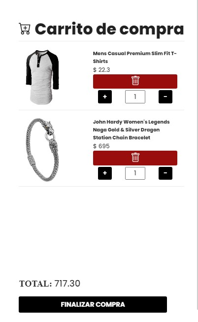

# Getting Started with Create React App

This project was bootstrapped with [Create React App](https://github.com/facebook/create-react-app).

## Comandos disponibles

En este proyecto puedes ejecutar:

### `npm start`

Ejecuta la aplicacion en el entorno de desarrollo\
Abre [http://localhost:3000](http://localhost:3000) para verlo en el navegador.

La pagina se recargara si haces cambios.\
Tambien podras ver los errores en la consola.

## PRUEBA REACT

Ejercicio orientado a la creacion de un e-commerce haciendo uso de ReacJS.

La web consiste en:

## Componente Home:

- Header
- Navbar(links a home y productos)
- Una imagen que hace de banner publicitario
- Cuatro cards de productos con sus respectivas imagenes y nombres
- Footer(links a las paginas principales de facebook,intagram y twiter)

## Componente Productos:

- Header
- Navbar(links a home y productos)
- Listado de 20 productos con su respectivo titulo, imagen y precio (link al detalle de cada articulo)
- Footer(links a las paginas principales de facebook,intagram y twiter)

## Componente Detalle:

- Header
- Navbar(links a home y productos)
- Detalle del producto seleccionado en el componente productos. Contiene: Una imagen agrandada, titulo, precio y descripcion
- Boton para agregar al carrito
- Footer(links a las paginas principales de facebook,intagram y twiter)

## Componente Sidebar:

- Cajon dinamico activado mediante el boton de agregar al carrtio en el componente detalle
- Este cajon renderiza los productos agregados al carrito de compras
- Imagen del producto
- Precio del producto
- Selectores de cantidad (+) (-)
- Input que muestra la cantidad de cuantas veces se ha agregado un producto
- Boton para eliminar el producto deseado
- Boton para Finalizar la compra(Mensaje: "La compra fue un exito")
  

## Tecnologias utilizadas
